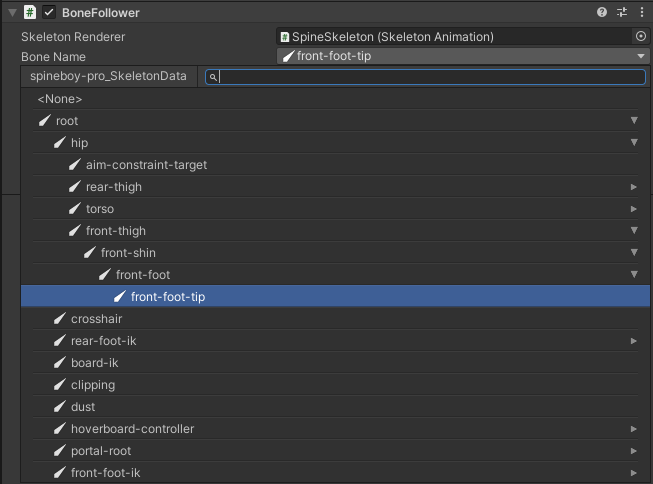

# Odin inspector extensions for Spine

Enhanced spine-unity with Odin Inspector.

## List of enhancements
### Odin SpineBone drawer

## Dependencies
In order to use this extension you need to already have installed
- [Odin Inspector](https://odininspector.com/)
- [Spine-unity](http://en.esotericsoftware.com/spine-unity-download)

## Installation
There are two possible ways to install this extenstion:
### Using UPM
Add package from git URL: `https://github.com/vhristov/spine-odin-extensions.git#4.1`

This requires spine runtimes also to be installed as an UPM packages.
### Using spine with `.unitypackage`
Download the project source code and place it somewhere inside your `Assets` folder

## Contributing
Pull requests are welcome. For major changes, please open an issue first to discuss what you would like to change.

## License
[MIT](https://choosealicense.com/licenses/mit/)
